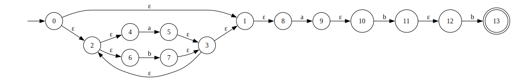

# Regex to NFA

### To Install the Requirements and Run the Project

```bash
pip install -r requirements.txt

streamlit run main.py   # For the GUI
python cli.py   # For the CLI
```

## Project Components

- Parser
- NFA Constructor
- NFA Visualizer

## Valid regex operators

- `.`: Concatination (`concat`).
- `|`: Union (`union`).
- `*`: Kleene star (`star`).
- `+`: Kleene plus (`plus`).
- `?`: Optional (`optional`).

## Parsing

**Goal**: Convert an input string regex into a structured blueprint for representation.

**Input**: A valid string regex.

**Output**: Abstract syntax tree.

### Process

1. Validate the input string.
2. Tokenize the string.
3. Apply precedence.
4. Convert to AST.

### Example AST

For the regex `(a|b)*abb`:

```py
ast_representation = {
    "type": "concat",
    "left": {
        "type": "star",
        "left": {
            "type": "union",
            "left": "a",
            "right": "b"
        },
        "right": 0, # kleene star is a unirary operator
    },
    "right": {
        "type": "concat",
        "left": "a",
        "right": {
            "type": "concat",
            "left": "b",
            "right": "b"
        }
    }
}
```

## Constructing

**Goal**: Convert the blueprint into an actual NFA.

**Input**: AST.

**Output**: Data representing NFA (Formal definition).

### Process

- Handle operations using Thompson's Construction Algorithm.

### Example NFA

For the regex `(a|b)*abb`:

```py
nfa_representation = {
    "states": {0, 1, 2, 3, 4, 5, 6, 7, 8, 9, 10, 11},
    "start_state": 0,
    "accept_states": {11},
    "transitions": {
        0: {"_e": {1, 7}}, # _e is used as epsilon.
        1: {"a": {2}},
        2: {"_e": {6}},
        7: {"b": {8}},
        8: {"_e": {6}},
        6: {"_e": {0, 9}},
        9: {"a": {10}},
        10: {"b": {11}},
        11: {"b": {12}}
    }
}
```

## Visualization

**Goal**: Visualize the NFA

**Input**: NFA representation.

**Output**: NFA graph.

### Process

1. Input textfield to enter the regex.
2. "Visualize" button.
3. A box to show the output NFA.


### Example Visualization

For the regex `(a|b)*abb`:


